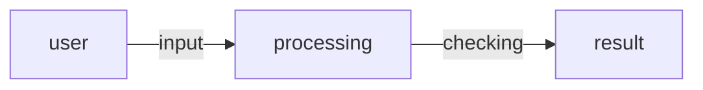

#flashcard
[[main.rs]]
[[code for running/guessingGame/src/main|main]]
[[Cargo.toml]]


Create new project folder
run:
```
cargo new guessingGame
```
that creates the folder:
[[Cargo.toml]]
[[manifest]]
[[helloword]]
[[main.rs]]
[[notes]]
```
❯ tree guessingGame
[4.0K]  guessingGame/
├── [4.0K]  src/
│   └── [  45]  main.rs
└── [  83]  Cargo.toml

2 directories, 2 files
```

Game logic 

Recieving user input 
- To obtain user input and then print the result as output, we need to bring the `io` input/output library into scope. The `io` library comes from the standard library, known as `std`:
```rust
use std::io;
```
 Rust has a set of items defined in the standard library that it brings into the scope of every program. This set is called the _prelude_

If a type you want to use isn’t in the prelude, you have to bring that type into scope explicitly with a `use` statement. Using the `std::io` library provides you with a number of useful features, including the ability to accept user input.

Storing values with variables
```rust 
let  mut guess = String::new();
```
In Rust, variables are immutable by default, meaning once we give the variable a value, the value won’t change. To make a variable mutable, we add `mut` before the variable name

`String::new`, a function that returns a new instance of a `String`. [`String`](https://doc.rust-lang.org/std/string/struct.String.html) is a string type provided by the standard library that is a growable, UTF-8 encoded bit of text.

The `::` syntax in the `::new` line indicates that `new` is an associated function of the `String` type. An _associated function_ is a function that’s implemented on a type, in this case `String`. This `new` function creates a new, empty string.

In full, the `let mut guess = String::new();` line has created a mutable variable that is currently bound to a new, empty instance of a `String`

call the `stdin` function from the `io` module, which will allow us to handle user input:
```rust
io::stdin()
	.read_line(&mut guess);
```

- the line `.read_line(&mut guess)` calls the [`read_line`](https://doc.rust-lang.org/std/io/struct.Stdin.html#method.read_line) method on the standard input handle to get input from the user.
	-  `&mut guess` as the argument to `read_line` to tell it what string to store the user input in.
- The full job of `read_line` is to take whatever the user types into standard input and append that into a string (without overwriting its contents), so we therefore pass that string as an argument.
- The `&` indicates that this argument is a _reference_, which gives you a way to let multiple parts of your code access one piece of data without needing to copy that data into memory multiple times.
Handle the errors, during input collection 
```rust
.expect("failed");
```
The whole thing can be written as such;
(relatively)
```rust 
io::stdin().read_line(&mut guess).expect("failed);
```
(absolutely)
```rust
std::io::stdin().read_line(&mut guess).expect("failed);
```

one long line is difficult to read, so it’s best to divide it. It’s often wise to introduce a newline and other whitespace to help break up long lines when you call a method with the `.method_name()` syntax.

Introducing Randomness

- The `rand` crate 
add to dependencies first 
```rust
[
dependencies
]
rand = "0.8.6"
```
we use  it the same way we used `std::io` 
```rust
use rand::Rng;
```
Introduce a secret random number 
```rust
let secret_number = rand::thread_rng().gen_range(1..=100);
```

The `Rng` trait defines methods that random number generators implement, and this trait must be in scope for us to use those methods.
`rand::thread_rng()` the same as callin a function, it sets the variable to a random secret.`gen_range(1..=100)` generates a range from which that secret number will be selected. Think of it like `start..=end`

Guess vs Secret 
Comparing the guess to the secret to decide if its less than, greater than or equal. Makes the game more fun 
Introducing the `cmp` library with the `Ordering` type

`use std::cmp::Ordering;`

The whole logic behind all this is the `match` expression, which utilises arms(patterns) to compare and deduce results

We use shadowing, to like create a comparision factor, shadowing lets us resuse declared variables. It is often used when wanting to convert one value from type to type 

```rust
let guess: u32 = guess.trim().parse().expect("input please");
```
right, this for when prossesing user input

We bind this new variable to the expression `guess.trim().parse()`. The `guess` in the expression refers to the original `guess` variable that contained the input as a string. The `trim` method on a `String` instance will eliminate any whitespace at the beginning and end, which we must do before we can convert the string to a `u32`, which can only contain numerical data.

The [`parse` method on strings](https://doc.rust-lang.org/std/primitive.str.html#method.parse) converts a string to another type. Here, we use it to convert from a string to a number. We need to tell Rust the exact number type we want by using `let guess: u32`. The colon (`:`) after `guess` tells Rust we’ll annotate the variable’s type. Rust has a few built-in number types; the `u32` seen here is an unsigned, 32-bit integer. It’s a good default choice for a small positive number.

the `u32` annotation in this example program and the comparison with `secret_number` means Rust will infer that `secret_number` should be a `u32` as well. So, now the comparison will be between two values of the same type

comaparing;
```rust
match guess.cmp(&secret_number) {
	Ordering::Less => println!("too small"),
	Ordering::Greater => println!("too big"),
	Ordering::Equal => println!("You win");
}
```
think of it like if statements but boogie
> if guess is less than secret print too small......

