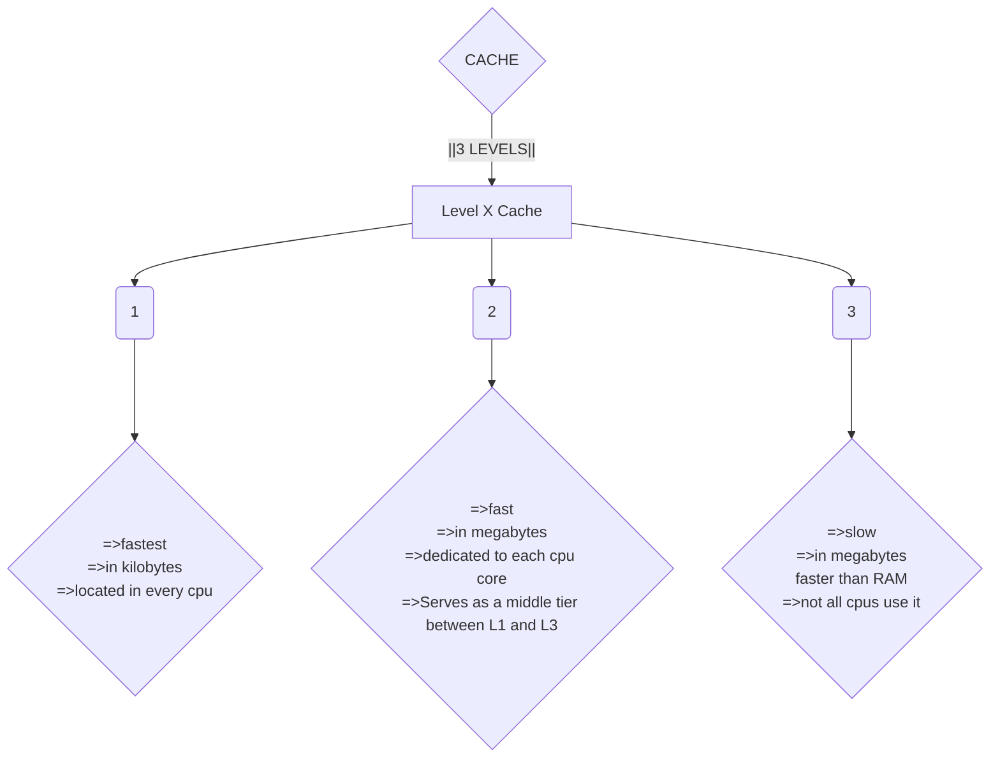

![[Pasted image 20260726174508.png]]

**MEMORY**

This is where temporary data/instructions of running programs are located
`Primary memory` - This what computer memory is known as
- The CPU uses it to retrieve and process data. 
The types of memory include:
- [ ] `Cache` - Located in the CPU itself, running at the same clock speed and the cpu and being very limited in size. The cache is extremely fast 
There are usually three levels of cache memory, depending on their closeness to the CPU core:

- [ ] 
