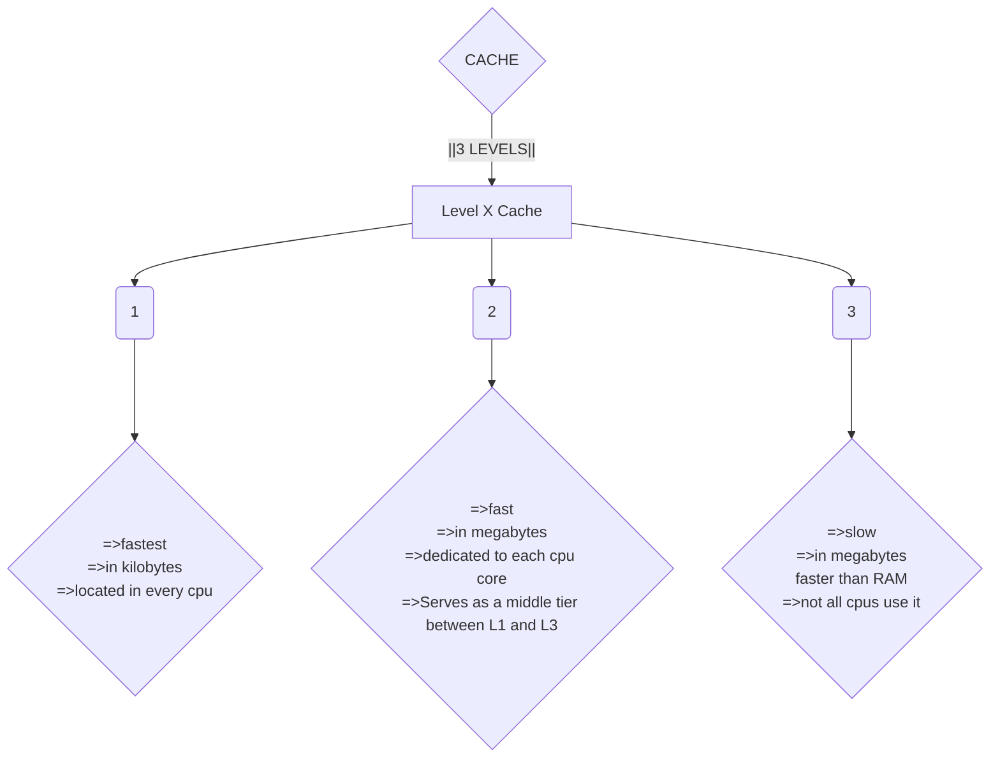

![[Pasted image 20260726174508.png]]

**MEMORY**

This is where temporary data/instructions of running programs are located
`Primary memory` - This what computer memory is known as

- The CPU uses it to retrieve and process data. 
  The types of memory include:

- [ ] `Cache` 
  Located in the CPU itself, running at the same clock speed and the cpu and being very limited in size. The cache is extremely fast 

There are usually three levels of cache memory, depending on their closeness to the CPU core:

- [ ] Random Access Memory
  `RAM` is much larger than cache memory, coming in sizes ranging from gigabytes up to terabytes. `RAM` is also located far away from the `CPU` cores and is much slower than cache memory. Accessing data from RAM addresses takes many more instructions.

For example, retrieving an instruction from the registers takes only one clock cycle, and retrieving it from the L1 cache takes a few cycles, while retrieving it from RAM takes around 200 cycles. When this is done billions of times a second, it makes a massive difference in the overall execution speed.

The maximum possible RAM size was 232 bytes, which is only 4 gigabytes, at which point we run out of unique addresses. With 64-bit addresses, the range is now up to `0xffffffffffffffff`, with a theoretical maximum RAM size of 264 bytes, which is around 18.5 exabytes (18.5 million terabytes), so we shouldn't be running out of memory addresses anytime soon.

When a program is run, all of its data and instructions are moved from the storage unit to the RAM to be accessed when needed by the CPU. This happens because accessing them from the storage unit is much slower and will increase data processing times. When a program is closed, its data is removed or made available to re-use from the RAM.

the RAM is split into four main `segments`
![[Pasted image 20260726185640.png]]

| Segment | Description                                                                                                                                                                                      |
| ------- | ------------------------------------------------------------------------------------------------------------------------------------------------------------------------------------------------ |
| `Stack` | Has a Last-in First-out (LIFO) design and is fixed in size. Data in it can only be accessed in a specific order by push-ing and pop-ing data.                                                    |
| `Heap`  | Has a hierarchical design and is therefore much larger and more versatile in storing data, as data can be stored and retrieved in any order. However, this makes the heap slower than the Stack. |
| `Data`  | Has two parts: `Data`, which is used to hold variables, and `.bss`, which is used to hold unassigned variables (i.e., buffer memory for later allocation).                                       |
| `Text`  | Main assembly instructions are loaded into this segment to be fetched and executed by the CPU.                                                                                                   |

THE STACK