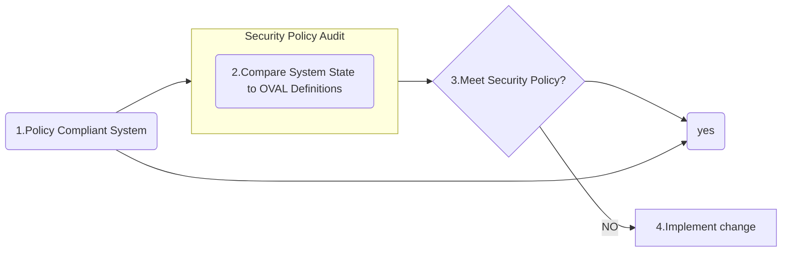

# Open Vulnerability Assessment Language 

[Open Vulnerability Assessment Language (OVAL)](https://oval.mitre.org/) is a publicly available information security international standard used to evaluate and detail the system's current state and issues.

OVAL provides a language to understand encoding system attributes and various content repositories shared within the security community.

It brings together community ideas for automating vulnerability management, measurement, and ensuring systems meet policy compliance

### The Oval Process

![[Pasted image 20260721165914.png]]
The goal of the OVAL language is to have a three-step structure during the assessment process that consists of:

- Identifying a system's configurations for testing
- Evaluating the current system's state
- Disclosing the information in a report

The information can be described in various types of states, including: `Vulnerable`, `Non-compliant`, `Installed Asset`, and `Patched`.

### OVAL Definitions

The OVAL definitions are recorded in an XML format to discover any software vulnerabilities, misconfigurations, programs, and additional system information taking out the need to exploit a system. By having the ability to identify issues without directly exploiting the issue, an organization can correlate which systems need to be patched in a network.

The four main classes of OVAL definitions consist of:

- `OVAL Vulnerability Definitions`: Identifies system vulnerabilities
- `OVAL Compliance Definitions`: Identifies if current system configurations meet system policy requirements
- `OVAL Inventory Definitions`: Evaluates a system to see if a specific software is present
- `OVAL Patch Definitions`: Identifies if a system has the appropriate patch

Additionally, the `OVAL ID Format` consist of a unique format that consists of "oval:Organization Domain Name:ID Type:ID Value". The `ID Type` can fall into various categories including: definition (`def`), object (`obj`), state (`ste`), and variable (`var`). An example of a unique identifier would be `oval:org.mitre.oval:obj:1116`.

Scanners such as Nessus have the ability to use OVAL to configure security compliance scanning templates.

