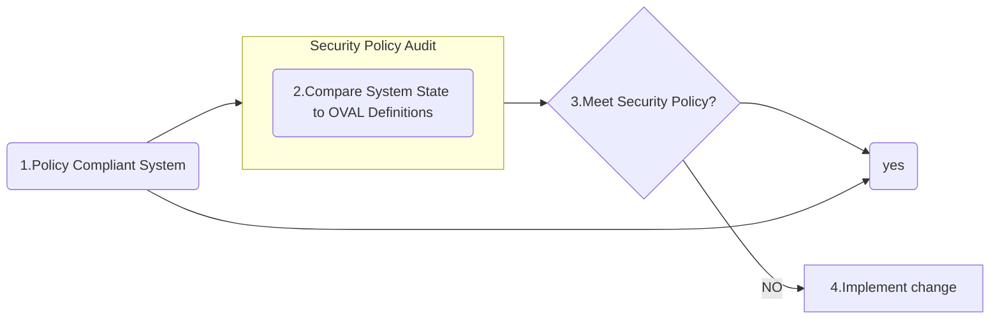

# Open Vulnerability Assessment Language 

[Open Vulnerability Assessment Language (OVAL)](https://oval.mitre.org/) is a publicly available information security international standard used to evaluate and detail the system's current state and issues.

OVAL provides a language to understand encoding system attributes and various content repositories shared within the security community.

It brings together community ideas for automating vulnerability management, measurement, and ensuring systems meet policy compliance

### The Oval Process

```mermaid
flowchart LR
    A(1.Policy Compliant System)
    subgraph B[Security Policy Audit]
         B1(2.Compare System State to OVAL Definitions)
    end 
    C{3.Meet Security Policy?}
    D[4.Implement change]
    
    A --> B --> C --NO--> D
    C-->E(yes)
    A-->E
```
![[Pasted image 20260721165914.png]]
The goal of the OVAL language is to have a three-step structure during the assessment process that consists of:

- Identifying a system's configurations for testing
- Evaluating the current system's state
- Disclosing the information in a report

The information can be described in various types of states, including: `Vulnerable`, `Non-compliant`, `Installed Asset`, and `Patched`.

### OVAL Definitions

The OVAL definitions are recorded in an XML format to discover any software vulnerabilities, misconfigurations, programs, and additional system information taking out the need to exploit a system. By having the ability to identify issues without directly exploiting the issue, an organization can correlate which systems need to be patched in a network.

The four main classes of OVAL definitions consist of:

- `OVAL Vulnerability Definitions`: Identifies system vulnerabilities
- `OVAL Compliance Definitions`: Identifies if current system configurations meet system policy requirements
- `OVAL Inventory Definitions`: Evaluates a system to see if a specific software is present
- `OVAL Patch Definitions`: Identifies if a system has the appropriate patch

Additionally, the `OVAL ID Format` consist of a unique format that consists of "oval:Organization Domain Name:ID Type:ID Value". The `ID Type` can fall into various categories including: definition (`def`), object (`obj`), state (`ste`), and variable (`var`). An example of a unique identifier would be `oval:org.mitre.oval:obj:1116`.

Scanners such as Nessus have the ability to use OVAL to configure security compliance scanning templates.
# Common Vulnerabilities and Disclosure

[Common Vulnerabilities and Exposures (CVE)](https://cve.mitre.org/) is a publicly available catalog of security issues sponsored by the United States Department of Homeland Security (DHS).

**CVE id**
A unique id given to a vulnerability

The following chart explains how a CVE ID may be assigned to a vulnerability. Any vulnerabilities assigned a CVE must be independently fixable, affect just one codebase, and be acknowledged and documented by the relevant vendor.
![[Pasted image 20260721171804.png]]

**Stages of Obtaining a CVE**

- [ ] Stage 1: Identify if CVE is Required and Relevant
	
	Identify if the issue found is a vulnerability. According to the CVE Team, "A vulnerability in the context of the CVE Program is indicated by code that can be exploited, resulting in a negative impact to confidentiality, integrity, OR availability, and that requires a coding change, specification change, or specification deprecation to mitigate or address." Additionally, research should verify there is not a CVE ID already in the CVE database.
	
- [ ] Stage 2: Reach Out to Affected Product Vendor

	A researcher should ensure they have made a good faith effort to contact a vendor directly. Researchers can reference CVE's [Documents on Disclosure Practices](https://cve.mitre.org/cve/researcher_reservation_guidelines#appendix#a) for additional information.

- [ ] Stage 3: Identify if Request Should Be For Vendor CNA or Third Party CNA

	If a company is a part of participating CNA's, they can assign a CVE ID for one of their products. If the issue is for a participating CNA, researchers can contact the appropriate CNA organization [here](https://cve.mitre.org/cve/request_id.html). If the vendor is not a participating CNA, a researcher should attempt to reach out to the vendor's third-party coordinator.

- [ ] Stage 4: Requesting CVE ID Through CVE Web Form

	The CVE Team has a form that can be filled out online [here](https://cveform.mitre.org/) if the methods above do not work for CVE requests.

- [ ] Stage 5: Confirmation of CVE Form

	Upon submitting the CVE Web Form mentioned in Stage 4, an individual will receive a confirmation email. The CVE team will contact the requestor if any additional information is required.

- [ ] Stage 6: Receival of CVE ID

	Upon approval, the CVE Team will notify the requestor of a CVE ID if the affected product's vulnerability is confirmed. Please note that the CVE ID is not public yet at this stage.

- [ ] Stage 7: Public Disclosure of CVE ID

	CVE IDs can be announced to the public as soon as appropriate vendors and parties are aware of the issue to prevent duplication of CVE IDs. This stage ensures that all associated parties are aware of the problem before being publicly disclosed
- [ ] Stage 8: Announcing the CVE

	The CVE Team asks researchers who are sharing multiple CVEs to ensure each CVE indicates the different vulnerabilities. Additional information can be found [here](https://cve.mitre.org/cve/researcher_reservation_guidelines).

- [ ] Stage 9: Providing Information to The CVE Team

	At this stage, the CVE Team asks that the researcher help provide additional information to be used in the official CVE listing on the website. The [U.S. National Vulnerability Database (NVD)](https://nvd.nist.gov/) maintains this information online in their database as well.

