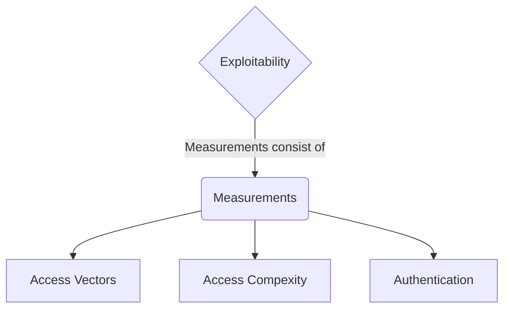
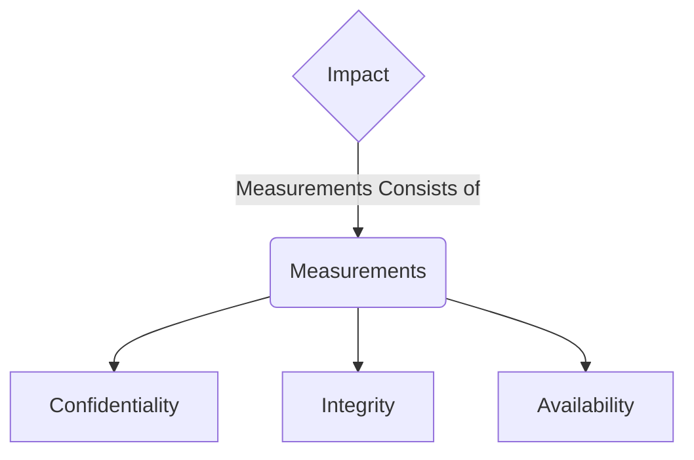

The Common Vulnerability Scoring system 
- an industry standard for performing standards for performing vulnerability scoring and severity rating calculations 
- `DREAD` is a risk assessment system developed by Microsoft to help IT security professionals evaluate the severity of security threats and vulnerabilities
> CVSS system + Microsoft DREAD = Calculation
- Factors needed for calculations:
1. Damage Potential
2. Reproducibility
3. Exploitability
4. Affected Users
5. Discoverability
The CVSS scoring consists of the `exploitability and impact` of an issue.

Exploitability Metrics

Impact Metrics 

![[Pasted image 20260721101033.png|697]]

CVSS METRICS
![[Pasted image 20260721101121.png]]

### Base Metric Group

Represents the vulnerability characteristics and consists of `exploitability` metrics(*a way to evaluate the technical means needed to exploit the issue*) and `impact` metrics(*represent the repercussions of successfully exploiting an issue and what is impacted in an environment*)

### Temporal Metric Group 

Details the availability of exploits or patches regarding the issue

**Exploit Code Maturity**

The `Exploit Code Maturity` metric represents the probability of an issue being exploited based on ease of exploitation techniques. There are various metric values associated with this metric, including `Not Defined`, `High`, `Functional`, `Proof-of-Concept`, and `Unproven`.
- `Not Defined` value relates to skipping this particular metric. 
- `High` value represents an exploit consistently working for the issue and is easily identifiable with automated tools.
- `Functional` value indicates there is exploit code available to the public. 
- `Proof-of-Concept` demonstrates that a PoC exploit code is available but would require changes for an attacker to exploit the issue successfully.

**Remediation Level

The `Remediation level` is used to identify the prioritization of a vulnerability. The metric values associated with this metric include `Not Defined`, `Unavailable`, `Workaround`, `Temporary Fix`, and `Official Fix`.
- `Not Defined` value relates to skipping this particular metric
- `Unavailable` value indicates there is no patch available for the vulnerability
- `Workaround`value indicates an unofficial solution released until an official patch by the vendor
- `Temporary fix` means an official vendor has provided a temporary solution but has not released a patch yet for the issue
- `Official fix` indicates a vendor has released an official patch for the issue for the public.

**Report Confidence

`Report Confidence` represents the validation of the vulnerability and how accurate the technical details of the issue are. The metric values associated with this metric include `Not Defined`, `Confirmed`, `Reasonable`, and `Unknown`.
- `Not Defined` value relates to skipping this particular metric
- `Confirmed` value indicates there are various sources with detailed information confirming the vulnerability
- `Reasonable` value indicates sources have published information about the vulnerability. However, there is no complete confidence that someone would achieve the same result due to missing details of reproducing the exploit for the issue.

### Environmental Metric group 

The Environmental metric group represents the significance of the vulnerability of an organization, taking into account the CIA triad.

**Modified Base Metrics

The `Modified Base metrics` represent the metrics that can be altered if the affected organization deems a more significant risk in Confidentiality, Integrity, and Availability to their organization. The values associated with this metric are `Not Defined`, `High`, `Medium`, and `Low`.
- `Not Defined` value would indicate skipping this metric.
- `High` value would mean one of the elements of the CIA triad would have *astronomical* effects on the overall organization and customers
- `Medium` value would indicate one of the elements of the CIA triad would have *significant* effects on the overall organization and customers.
- `Low` value would indicate one of the elements of the CIA triad would have *minimal* effects on the overall organization and customers.

## CVSS calculator
https://nvd.nist.gov/vuln-metrics/cvss/v3-calculator

#### CVSS Calculation Example

For example, for the Windows Print Spooler Remote Code Execution Vulnerability, CVSS Base Metrics is 8.8. You can reference the values of each metric value [here](https://msrc.microsoft.com/update-guide/vulnerability/CVE-2021-34527).

