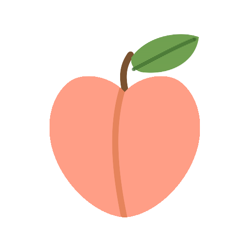

<p align="center">
  
</p>

<h1 align="center">Peaches</h1>

<p align="center">
  <strong>Pick a topic. Grow into it.</strong><br />
  A security tutor that lives in your AI coding assistant — Socratic deep-dives, hands-on security labs, and spaced repetition.<br />
  <em>Built for chronic ADHD: one next step, never a wall of gaps.</em>
</p>

<p align="center">
  <a href="https://www.npmjs.com/package/peaches"></a>
  <a href="https://nodejs.org/"></a>
  <a href="https://pnpm.io/"></a>
  <a href="./LICENSE"></a>
</p>

---

## What is Peaches?

**Peaches** is an AI-powered security curriculum that generates skill and command files for **28 AI coding tools** — Claude Code, Cursor, Codex, OpenCode, and more. Your assistant gains seven slash commands covering the full spectrum:

🛡️ **AppSec & defensive** ▸ OWASP Top 10, secure design, code review, authn/authz, secrets, supply chain, incident response
🎯 **Offensive** ▸ recon, exploitation primitives, web/mobile/cloud attack surface, reverse engineering, CTFs
🔐 **Cryptography** ▸ primitives, key management, protocol design, common crypto flaws
🧱 **Foundations** ▸ networking, DNS, TLS/TCP/IP, OS internals, Linux hardening

Every offensive concept is taught **paired with its defence and its detection signal**, and every lab runs locally or on a deliberately vulnerable target.

### Built for chronic ADHD

The bottleneck with a learning system is rarely ability — it is friction, decision paralysis, and shame after a lapse. Peaches is designed around that:

| Problem | What Peaches does |
| :--- | :--- |
| A big opening move | The map starts at **one** concept and grows on demand — never a 25-item syllabus |
| "What do I do now?" | **`/peaches:next`** picks the single best action and starts it. No menu, no recall |
| Choice paralysis | Every workflow recommends one next step instead of listing options |
| Lost your place | Every workflow resumes the exact thing you were last doing |
| A lapse turns into shame | No streaks, no "days ago", no catch-up nagging. Long gaps silently widen the interval |
| A wall of unfinished | Progress views show only what you've touched. Unexplored is absent, not grey |
| Sessions you can't cut short | Every change is valid whether you return in five minutes or five weeks |

These rules live in one place — `ADHD_PROTOCOL` in `_shared.ts` — and are imported by all seven workflows, so behaviour stays consistent. A test fails the build if any workflow drops it, or reintroduces lapse-guilt language.

## Quick Start

```bash
# Interactive mode — auto-detects your AI tools and prompts you to choose
npx @0xclumzzy/peaches init

# Target specific tools
npx @0xclumzzy/peaches init --tools opencode

# Or install globally
npm install -g @0xclumzzy/peaches   # or: pnpm add -g @0xclumzzy/peaches
peaches init
```

> The package is published under the `@0xclumzzy` scope because the unscoped
> name `peaches` on npm is already owned by an unrelated 2012 CSS compiler.
> The binary is still just `peaches` — only the install path is scoped.

### Context7 Integration _(optional)_

During `init` or `update`, you'll be prompted to enable **Context7** for documentation verification. When enabled, the AI fetches official docs and cross-references its explanations against authoritative sources — dramatically improving teaching accuracy.

> **Setup:** Run `npx ctx7 setup` or visit the [Context7 docs](https://context7.com/docs/resources/all-clients) for your AI tool.

### After Init — Seven Commands

| Command | What it does |
| :--- | :--- |
| `/peaches:next` | **Start here.** Picks the single best next step and begins it. No arguments, no recall |
| `/peaches:topic <name>` | Start or resume a security topic; the map grows one concept at a time |
| `/peaches:explain <name>` | The mechanism — attack and defence, one level deep unless you ask for more |
| `/peaches:practice <name>` | Security labs: find the flaw, build the primitive, harden the fix, or read the evidence |
| `/peaches:review [name]` | Decide what to reinforce next from your progress |
| `/peaches:status [name]` | Heatmap of the concepts you have actually touched |
| `/peaches:quiz <name>` | Quick five-question quiz, saved as a reusable deck |

> `/peaches:next` is the whole onboarding. If you only ever run one command, run
> that one.

### Visual Learning Dashboard

Start a zero-config web dashboard to browse your learning data:

```bash
# Start the visual dashboard (no npm install needed)
npx @0xclumzzy/peaches serve

# Custom port
npx @0xclumzzy/peaches serve --port 8080

# Disable auto-open browser
npx @0xclumzzy/peaches serve --no-open
```

> The dashboard is pre-built and shipped with the CLI — no extra dependencies or `npm install` required.
> If you installed globally, you can use `peaches serve` instead.

The dashboard provides:

▪ **Knowledge Map** ▸ Markdown-rendered overview of your learning topic
▪ **Session Notes** ▸ browse and read every session note, organized by domain
▪ **Exercise Viewer** ▸ starter code, solutions, and practice results, with syntax highlighting
▪ **Dark only** ▸ a deliberate single dark theme, tuned for contrast
▪ **i18n** ▸ full English and Chinese interface
▪ **Hot Reload** ▸ auto-refresh when you add or modify topic files

## How It Works

`init` is a one-time, local generation step. There is no daemon and no account — Peaches writes plain files that your assistant reads as instructions. _(If you opt into Context7 during setup, your assistant will fetch official library docs from `context7.com`; that is the only network call, and it is optional.)_

**1. Generate.** Peaches writes a command file and a skill file for each of the seven workflows, using whatever format your tool expects.

**2. Adopt a persona.** Each skill opens by casting your assistant into a specific Peaches role, so behaviour stays consistent no matter which tool you drive:

| Command | Assistant becomes | Effect |
| :--- | :--- | :--- |
| `/peaches:next` | Peaches' _Next Step Coach_ | read-only — reads `state.json`, picks one action, starts it |
| `/peaches:topic` | Peaches' _Knowledge Mentor_ | creates `state.json`, renders `knowledge-map.md`, sets up `sessions/` |
| `/peaches:explain` | Peaches' _Explanation Mentor_ | writes `sessions/<domain>/<concept>-<date>.md`, updates `state.json` |
| `/peaches:practice` | Peaches' _Practice Coach_ | writes `exercises/<concept-slug>/…-practice-<date>.md`, updates `state.json` |
| `/peaches:quiz` | Peaches' _Quiz Coach_ | writes `quizzes/<concept-slug>/…-quiz-<timestamp>.json`, updates `state.json` |
| `/peaches:review` | Peaches' _Learning Analyst_ | read-only — reads `state.json` and plans what to reinforce |
| `/peaches:status` | Peaches' _Status Visualizer_ | read-only — runs the status script over `state.json` |

Every skill also carries two shared blocks, so the behaviour is identical whichever
command you run:

✦ **`SECURITY_SCOPE`** ✧ the four tracks, the "pair every attack with its defence"
  rule, the authorise-before-offensive-operations boundary, and CVE-currency guidance.
◆ **`ADHD_PROTOCOL`** ◇ the ten interaction rules in the table above.

**3. Keep the state.** Every workflow updates `state.json`, which is what makes progress, spaced repetition, and the dashboard work later.

```
Your Project/
├── .claude/
│   ├── commands/peaches/          # Slash commands for Claude
│   └── skills/                  # Skill files with full workflow instructions
├── .cursor/commands/            # Cursor-specific command format
├── .gemini/commands/peaches/      # Gemini TOML-format commands
├── .codex/prompts/              # Codex prompt files
│   ...                          # (30+ other tool formats)
│
├── .peaches/                      # 🍑 Your learning data lives here
│   └── topics/
│       └── typescript/
│           ├── state.json           # Single source of truth
│           ├── knowledge-map.md     # Auto-rendered from state.json
│           ├── sessions/            # Session history for spaced repetition
│           ├── exercises/           # TDD-style coding exercises
│           └── quizzes/             # Reusable text Q&A question decks
└── ...
```

Each AI tool receives **tool-appropriate file formats** via an adapter pattern — YAML frontmatter for Claude, TOML for Gemini, Markdown for Cursor, etc.

> Your `.peaches/` directory is plain Markdown and JSON, so it is safe in git and readable without Peaches installed.

## Monorepo Structure

```
peaches/
├── packages/
│   ├── cli/                     # peaches — published to npm
│   │   ├── site/                 # Dashboard source (Vue 3 + Vite)
│   │   ├── scripts/              # Build scripts (bundle-site.mjs)
│   │   ├── src/
│   │   │   ├── cli/             # Commander.js CLI entry point
│   │   │   ├── core/            # init, config, command generation, templates
│   │   │   ├── i18n/            # en locale messages
│   │   │   └── utils/           # Filesystem, interactive helpers
│   │   ├── bin/                 # peaches binary
│   │   └── package.json
├── openspec/                     # Spec-driven change proposals and capability specs
├── .github/workflows/ci.yml      # Lint, typecheck, test (Node 20/22), build
├── pnpm-workspace.yaml          # pnpm workspace config
├── tsconfig.base.json           # Shared compiler options
├── package.json                 # Workspace root (private)
└── pnpm-lock.yaml
```

| Package                                | npm                                                                                                                    | Description                                              |
| :------------------------------------- | :--------------------------------------------------------------------------------------------------------------------- | :------------------------------------------------------- |
| [`peaches`](./packages/cli) | [](https://www.npmjs.com/package/peaches) | CLI tool — generate skill/command files for 28 AI tools |
| `peaches-site`                 | _private_                                                                                                              | The visual learning dashboard (Vue 3 + Vite)             |

The dashboard at `packages/cli/site/` is the graphical interface; it is bundled into the published CLI and served by `peaches serve`.

## Supported AI Tools

> Amazon Q Developer, Antigravity, Auggie, Bob Shell, Claude Code, Cline, Codex, ForgeCode, CodeBuddy Code, Continue, CoStrict, Crush, Cursor, Factory Droid, Gemini CLI, GitHub Copilot, iFlow, Junie, Kilo Code, Kiro, OpenCode, Pi, Qoder, Lingma, Qwen Code, RooCode, Trae, Windsurf, and AGENTS.md-compatible assistants.

```bash
# Update existing skill files to the latest version (auto-detects installed tools)
npx peaches update
```

## Development

### Prerequisites

◦ **Node.js** ≥ 20
◦ **pnpm** ≥ 10 (the workspace uses `allowBuilds`, a pnpm 10 setting)

### Setup

```bash
git clone https://github.com/0xClumzzy/peaches.git
cd peaches
pnpm install
```

### Commands

| Command           | Description                          |
| :---------------- | :----------------------------------- |
| `pnpm build`      | Build all packages (`tsc`)           |
| `pnpm test`       | Run all tests (`vitest run`)         |
| `pnpm test:watch` | Run tests in watch mode              |
| `pnpm dev`        | TypeScript watch mode (all packages) |
| `pnpm lint`       | Lint all packages (`eslint`)         |
| `pnpm format`     | Format code (`prettier`)             |
| `pnpm dev:site`   | Dev server for the visual dashboard  |

### Per-Package Commands

```bash
pnpm -F peaches build      # Build only CLI
pnpm -F peaches test       # Test only CLI
pnpm -F peaches dev:cli    # Build and run CLI locally
```

## Star History

<a href="https://star-history.dera.page/#0xClumzzy/peaches&type=date&legend=top-left">
  <picture>
    <source media="(prefers-color-scheme: dark)" srcset="https://star-history.dera.page/svg?repos=0xClumzzy/peaches&type=date&theme=dark&legend=top-left" />
    <source media="(prefers-color-scheme: light)" srcset="https://star-history.dera.page/svg?repos=0xClumzzy/peaches&type=date&legend=top-left" />
    
  </picture>
</a>

## License

[MIT](./LICENSE) © [0xClumzzy](https://github.com/0xClumzzy)

---

<p align="center">
  <sub>Built with ❤️ for curious minds · <a href="https://github.com/0xClumzzy/peaches">GitHub</a> · <a href="./CONTRIBUTING.md">Contributing</a> · <a href="./CHANGELOG.md">Changelog</a></sub>
</p>
